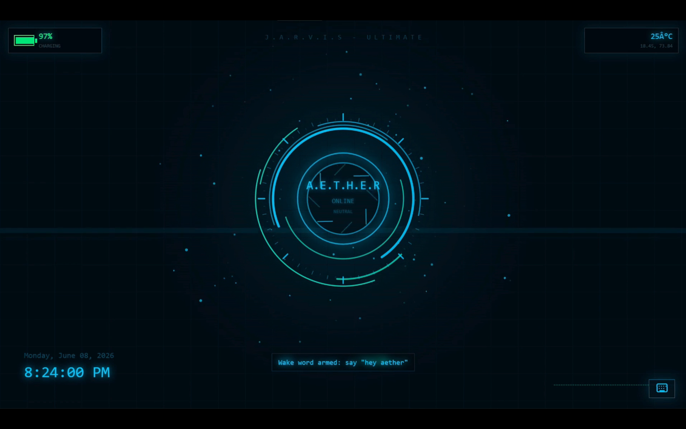
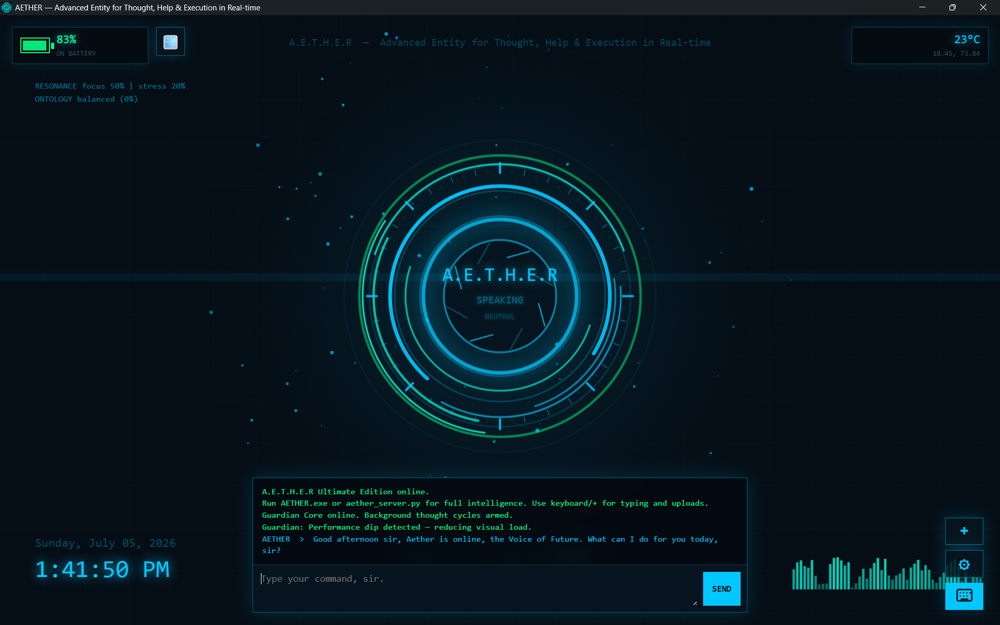
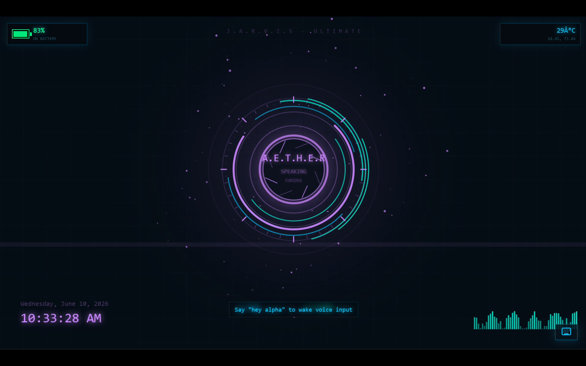
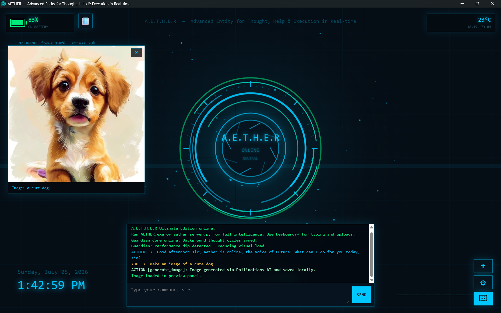
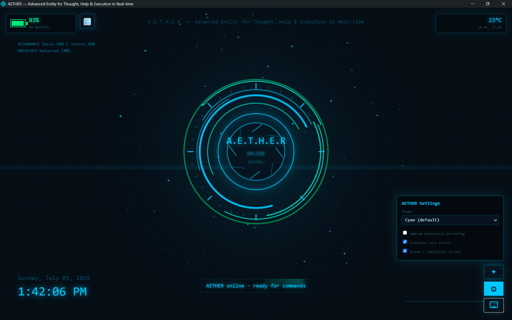

# AETHER

# AETHER

### *The Voice of the Future*

An AI assistant for Windows that combines natural voice conversations, long-term memory, image generation, system control, and fast AI responses into a single desktop application.

### ⭐ Download the latest version

➡️ **https://github.com/Alpha-Knight-ux/AETHER/releases/latest**

---

## ✨ Features

🎤 **Natural Voice Conversations**

Talk to AETHER naturally using your microphone.

---

🧠 **Long-Term Memory**

Remembers important information during conversations.

---

🖼️ **AI Image Generation**

Generate images directly inside AETHER.

---

🖥️ **Full Windows System Control**

Open apps, control the system, and automate common tasks.

---

📂 **File & Folder Assistant**

Search, organize, and interact with your files.

---

⚡ **Lightning Fast**

Powered by **Groq API** for ultra-fast AI responses.

---

🤖 **Modern AI**

Built using **Llama 3** with powerful desktop capabilities.

---

# 📸 Screenshots

| Home | Chat |
|------|------|
|  |  |

| Voice | Image Generation |
|------|------|
|  |  |

| Memory | Settings |
|------|------|
|  |  |

---

# 🚀 Installation

1. Download **Aether_setup.exe** from the latest release.
2. Run the installer.
3. Launch **AETHER**.
4. Enter your Groq API Key.
5. Start chatting!

---

# 💻 System Requirements

| Requirement | Minimum |
|-------------|----------|
| Operating System | Windows 10 / Windows 11 |
| Architecture | 64-bit |
| RAM | 8 GB |
| Storage | 500 MB |
| Internet | Required |
| Microphone | Recommended |

---

# 🛣 Roadmap

- ✅ Voice Assistant
- ✅ Long-Term Memory
- ✅ Image Generation
- ✅ Windows System Control
- ⬜ Android App
- ⬜ Microsoft Store
- ⬜ Custom AI Model
- ⬜ Vision Support
- ⬜ Multi-language Support

---

# ❤️ Support

If you enjoy AETHER,

⭐ **Star this repository**

🐛 Report bugs using GitHub Issues

💡 Suggest new features

---

# 👨‍💻 Developer

Created with ❤️ by **Aarush Anish**

© 2026 Aarush Anish. All rights reserved.

